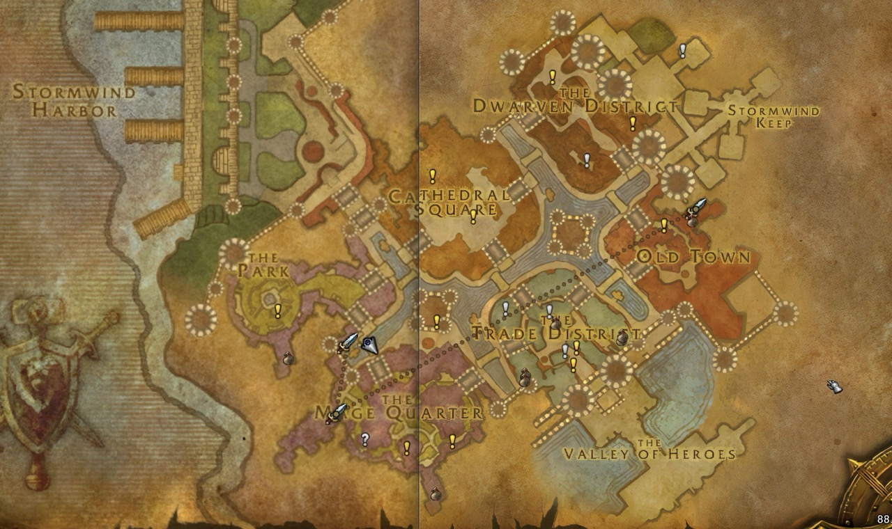
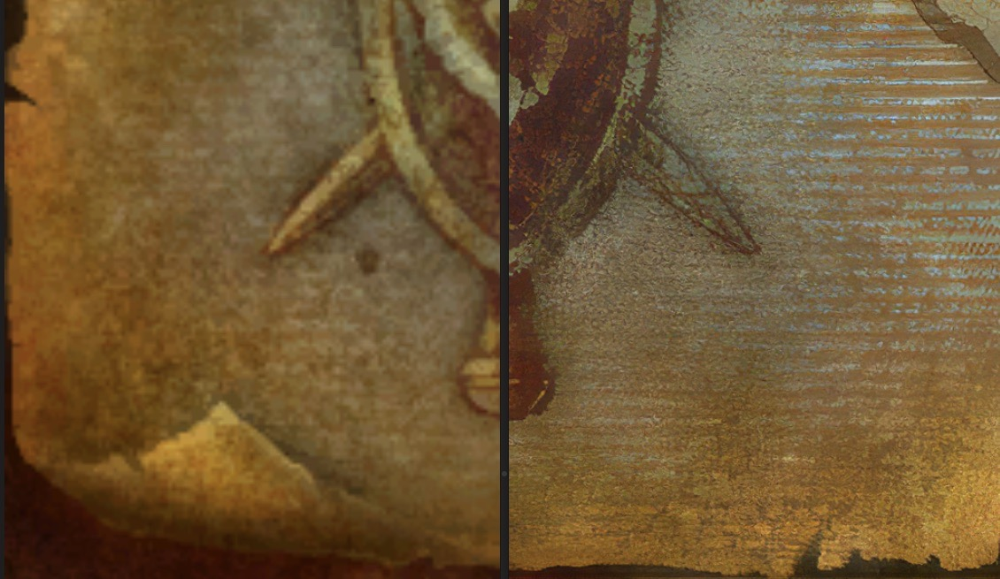

# Turtle Restoration Project (TRP)

> *"Ye think ye know the lands o' Azeroth, do ye? There's much yet to discover, if yer willing to seek it."*   
> – Brann Bronzebeard

The **Turtle Restoration Project** (TRP) enhances the world maps and loading screens of World of Warcraft’s classic era (version 1.12.1) through machine learning upscaling, tailored specifically for [**Turtle WoW**](https://turtle-wow.org). Created to complement the server’s fan-made expansion, **Mysteries of Azeroth**, TRP aligns with the server’s mission to deepen players’ connection to the **Vanilla WoW** world, capturing Azeroth’s timeless sense of adventure.

  
  

At higher resolutions, the original Vanilla maps and loading screens appear blurry and lack detail. TRP addresses this by doubling the in-game resolution of map and loading screen files, while effectively increasing visual detail up to four times. The result is a sharper experience that enhances exploration and transitions, while preserving Azeroth’s iconic charm.

**Note:** While TRP aims for high-resolution quality, the limitations of the old WoW engine require careful adjustments to avoid crashes or instability. As a result, the final map quality may not fully match the resolution of current retail WoW maps but should come impressively close.

TRP is built in a modular way, following a three-phase approach for each map:

1. **Upscaling and Fixing Major Errors**: Initial upscaling of the map and addressing any prominent errors that may arise.
2. **Refining Labels**: Adjusting and improving labels, such as city names and region titles, to ensure clarity and alignment.
3. **Enhancing Visual Details**: Adding final touches to enhance other design elements for a polished, immersive look.

Starting with the major cities, each map requires considerable time and effort as I carefully work through these stages.

In the future, TRP may expand to other private servers under the name **Azeroth Restoration Project**, bringing the same visual upgrades to the broader WoW classic community.

---

## Project Progress

Below is an overview of the current progress on TRP. Each zone goes through three stages: **Upscaling**, **Relabeling**, and **Enhancement**. The checkmark indicates completion of that stage for each zone.

| Zone                     | Upscaled | Relabelled | Enhanced |
|--------------------------|----------|------------|----------|
| World Overview           | ✅        |            |          |
| Eastern Kingdoms Overview | ✅        |            |          |
| Kalimdor Overview        | ✅        |            |          |
| Capitals                 | In Progress       |            |          |
| Durotar                  | In Progress        |            |          |
| Elwynn Forest            | In Progress        |            |          |
| Loading Screens          | In Progress        |            |          |
| ...                      |          |            |          |

---

## Known Issues

Below is a list of known issues currently affecting the Turtle Restoration Project. Each issue includes a brief description, status, and relevant notes. This section will be updated as fixes or workarounds are implemented. If you come across other issues, please report them by opening an issue on GitHub or commenting [the post in the forums](https://forum.turtle-wow.org/viewtopic.php?t=15601).

| Issue                      | Description                                                                 | Status           | Notes                                     |
|----------------------------|-----------------------------------------------------------------------------|------------------|-------------------------------------------|
| Overlapping Alpha Borders  | Borders between explored and unexplored areas have overlapping alpha channels, resulting in a checkerboard effect. | Acknowledged     | Investigating potential fixes. |
| General Glitches           | Some areas of the upscaled maps display graphical glitches, particularly noticeable in Thunder Bluff. | Investigating    | Likely to be addressed in the next update. |
| Label Font Issues          | Some city and region labels appear distorted after machine learning upscaling. | Scheduled for Phase 2 | Requires manual relabeling for clarity.   |
| Blurry Zoom Levels         | When using the Magnify add-on, certain zoom levels show reduced sharpness.  | Investigating    | Likely caused by engine limitations.      |

---

## How to Use

The modules of the Turtle Restoration Project (TRP) are currently provided as sets of **.blp files**. To install them, simply place the provided `Interface` folder in the `/Data` directory of your WoW installation. 

For example, if you’re installing the Ironforge map, the path should look like this:

`WoW/Data/Interface/WorldMap/Ironforge/*.blp`

Once placed correctly, the enhanced maps will be automatically loaded in-game.

---

## Support the Project

The Turtle Restoration Project (TRP) is a solo, passion-driven effort to enhance the classic World of Warcraft experience. If you enjoy the improvements TRP brings to Turtle WoW and would like to support further development, you might consider a small, voluntary contribution.

- **[Ko-fi](https://ko-fi.com/thatguyturtles)** – Buy me a coffee to show your appreciation and help fund the project.
- **[PayPal](https://paypal.me/tisobr)** – One-time donations are also greatly appreciated.

Thank you for being part of the TRP journey and helping to bring Azeroth to life in new ways!

---

For more information or to join the discussion, please visit the [GitHub Repository](https://github.com/HerrTiSo/TurtleRestorationProject) and [Turtle Forum post](https://forum.turtle-wow.org/viewtopic.php?t=15601).

## Rediscover Azeroth with the Turtle Restoration Project—one map at a time!
